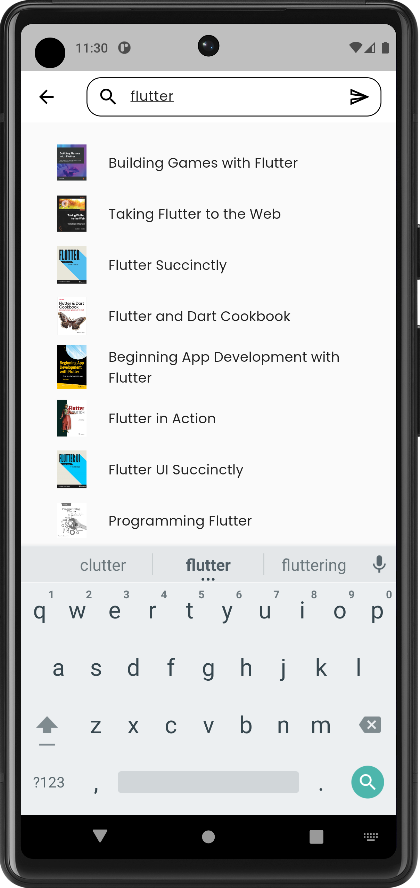

# it_engineer_books

This is just an example app to learn fetch data from external data sources.

Backend/Data Resources from IT Bookstore => https://api.itbook.store/  
Bookmark save on local using sqflite  
State management = Provider

## Screenshot

## Getting Started

For help getting started with Flutter development, view the
[online documentation](https://docs.flutter.dev/), which offers tutorials,
samples, guidance on mobile development, and a full API reference.
